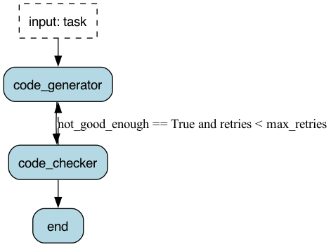

# AI Python Coding Agent - Apache Burr Implementation

This is an advanced Python coding agent built with Apache Burr that generates high-quality Python code through an intelligent iterative improvement system. The agent orchestrates code generation and validation workflows, automatically improving code quality through feedback loops until it meets production standards.

## 🌟 Key Features

- **Iterative Code Improvement**: Automatically refines code through up to 5 iterations when validation finds issues
- **Intelligent Feedback Loop**: Analyses validation results and provides targeted improvement suggestions
- **Quality Standards**: Enforces comprehensive type hints, docstrings, error handling, and PEP 8 compliance
- **AWS Bedrock Integration**: Leverages Claude 3.5 Sonnet for advanced code generation
- **Comprehensive Validation**: Static analysis including syntax checking, AST parsing, and quality metrics
- **Live Code Execution**: Optional Python code execution testing for functional validation
- **Session Reporting**: Generates detailed markdown reports with metrics, iteration tracking, and code samples
- **Production Readiness**: Quality threshold system ensures code meets production standards

## 🏗️ Burr Workflow Architecture



The system is built using Apache Burr's state machine framework with three main actions:

### 1. **Code Generator Action (`code_generator`)**
- **Reads**: `not_good_enough`, `retries`, `check_results`, `ai_analysis`, workflow timing & token tracking
- **Writes**: `generated_python_response`, `retries`, `task`, performance metrics
- Calls AWS Bedrock API with Claude 3.5 Sonnet model
- Generates production-ready Python code with comprehensive requirements
- Enforces type hints, docstrings, error handling, and PEP 8 compliance
- Incorporates feedback from previous iterations for targeted improvements

### 2. **Code Checker Action (`code_checker`)**
- **Reads**: `generated_python_response`, `task`, token tracking & performance metrics
- **Writes**: `not_good_enough`, `check_results`, `ai_analysis`, updated metrics
- Performs comprehensive static analysis and quality validation
- Executes optional live Python code testing (configurable)
- Returns detailed feedback for iterative improvement
- Determines if code meets production quality standards

### 3. **End Action (`end`)**
- **Reads**: All state variables for final reporting
- **Writes**: `workflow_end_time`
- Displays final results and comprehensive output
- Generates detailed markdown reports with complete workflow analysis
- Provides performance metrics and quality assessment summary

### Workflow Transitions

```
code_generator → code_checker → {
    if (not_good_enough == True AND retries < max_retries):
        → code_generator  // Retry with feedback
    else:
        → end             // Finalise results
}
```

## 📊 Quality Metrics & Iteration Logic

The agent uses a **warning threshold of 5 issues**:
- **≤ 5 warnings**: Code quality acceptable, workflow completes
- **> 5 warnings OR any critical issues**: Triggers automatic regeneration with targeted feedback
- **Maximum 5 retries** to prevent infinite loops
- **Comprehensive quality gates** ensure production readiness

### Quality Checks Include:
- ✅ Syntax validation and compilation
- ✅ Type hints for functions and parameters
- ✅ Comprehensive docstrings (Google/Sphinx style)
- ✅ Proper error handling with try/except blocks
- ✅ PEP 8 compliance and code style
- ✅ Security vulnerability scanning
- ✅ Performance best practices validation
- ✅ Test code syntax and structure verification
- ✅ Function naming conventions
- ✅ Optional live Python code execution testing
- ✅ Dependency validation and import checking

## 🛠️ Prerequisites

### System Requirements
- **Python**: >= 3.12
- **AWS Account** with Bedrock access
- **Claude 3.5 Sonnet** model enabled in your AWS region

### Python Environment Setup

```bash
# Using pyenv (recommended)
pyenv versions
pyenv install 3.12.8
pyenv local 3.12.8
python --version # to confirm the version
eval "$(pyenv init -)" # if the version is not 3.12.8

# Create and activate virtual environment
python -m venv .venv
source .venv/bin/activate  # On Windows: .venv\Scripts\activate
```

### Dependencies Installation

From the project root directory:

```bash
# Install all dependencies using uv (recommended)
uv sync

# Or using pip
pip install anthropic>=0.52.2 \
           boto3>=1.38.32 \
           burr[start]>=0.40.2 \
           instructor>=1.8.3 \
           python-dotenv>=1.1.0
```

## ⚙️ Configuration

### 1. AWS Configuration

Set up AWS SSO or configure credentials:

```bash
# AWS SSO (recommended)
aws configure sso
aws sso login

# Or traditional AWS credentials
aws configure
# Enter your AWS Access Key ID, Secret Access Key, and region
```

### 2. Environment Variables

Create a `.env` file in the project root:

```bash
# AWS Configuration
AWS_REGION=us-east-1  # Your preferred AWS region
AWS_PROFILE=default   # Your AWS profile name

# Optional: Model Configuration
MODEL=anthropic.claude-3-5-sonnet-20241022-v2:0
```

### 3. Workflow Configuration

Key configuration constants in `01_ai_workflow.py`:

```python
# Maximum number of retry attempts
MAX_RETRIES = 5

# Quality threshold (warnings limit)
WARNING_THRESHOLD = 5

# Enable/disable AI-powered analysis (optional advanced feature)
ENABLE_AI_ANALYSIS = False

# Enable/disable live code execution testing
ENABLE_CODE_EXECUTION = True
```

## 🚀 Usage

### Basic Usage

Run the workflow with predefined tasks:

```bash
# Navigate to the 01_ai_workflow directory
cd 01_ai_workflow

# Run simple task (factorial function)
uv run 01_ai_workflow.py simple

# Run moderate task (CSV analysis)
uv run 01_ai_workflow.py moderate

# Run complex task (web scraper)
uv run 01_ai_workflow.py complex

# Run all tasks sequentially
uv run 01_ai_workflow.py all

# Run the burr UI (to see the telemetry tool)
burr
```

### Predefined Tasks

#### Simple Task
```
Create a Python function that calculates the factorial of a number using recursion.
The function should handle edge cases like negative numbers and zero, and include 
comprehensive unit tests to validate its correctness.
```

#### Moderate Task
```
Create a function that analyses a CSV file containing student grades and calculates 
comprehensive statistics including mean, median, standard deviation, letter grade 
distribution, and identifies students who need academic intervention (below 70% average).
```

#### Complex Task
```
Create a Python function that implements a multi-threaded web scraper to extract 
product prices from an e-commerce website. The scraper should handle pagination, 
respect robots.txt rules, and implement error handling for network issues.
```

### Custom Task Usage

Modify the task in the `if __name__ == "__main__"` section or create your own:

```python
custom_task = """
Create a Python function that implements a binary search algorithm with comprehensive 
error handling, type hints, and unit tests.
"""

app = application()
app.run(halt_after=["end"], inputs={"task": custom_task})
```

## 📈 Output and Reporting

### Console Output

The workflow provides rich console output with:
- 🚀 Real-time progress indicators with emojis
- 📊 Quality metrics and validation results
- 🔄 Retry status and improvement feedback
- ⏱️ Performance timing and token usage
- 🎯 Final code artifacts and documentation

### Comprehensive Reports

Each workflow run generates a detailed markdown report including:

- **Quality Metrics Summary**: Issues, warnings, and success rates
- **Workflow Journey**: Attempt history and iteration tracking
- **Generated Artifacts**: Complete function code, tests, and documentation
- **Quality Assessment**: Detailed validation results and feedback
- **Performance Summary**: Token usage, timing, and efficiency metrics
- **Configuration Details**: Workflow settings and parameters

Reports are saved as: `ai_coding_workflow_report_YYYYMMDD_HHMMSS.md`

## 🔧 Advanced Usage

### Workflow Visualisation

Generate a visual representation of the Burr workflow:

```python
app = application()
app.visualize(
    include_conditions=True,
    format="png",
    output_file_path="ai_workflow",
)
```

This creates `ai_workflow.png` showing the complete state machine flow.

### Performance Monitoring

The workflow tracks comprehensive metrics:

```python
# Token usage tracking
total_tokens_used = state.get("total_tokens_used", 0)
generation_tokens = state.get("generation_tokens", 0)
analysis_tokens = state.get("analysis_tokens", 0)

# API call efficiency
api_call_count = state.get("api_call_count", 0)
generation_times = state.get("generation_times", [])

# Quality metrics
critical_issues = 0
warnings = 0
success_rate = passed_checks / total_checks
```

### Custom Quality Gates

Extend the quality validation by modifying the `code_checker` action:

```python
# Add custom security checks
custom_security_risks = {
    'custom_pattern': "Custom security concern message",
    'another_pattern': "Another security validation"
}
security_risks.update(custom_security_risks)

# Add custom performance checks
custom_performance_checks = {
    'performance_pattern': "Custom performance guidance",
    'efficiency_pattern': "Custom efficiency recommendation"
}
performance_checks.update(custom_performance_checks)
```

## 🛡️ Security & Best Practices

### Code Security

The workflow includes comprehensive security scanning for:
- `eval()` and `exec()` function usage
- SQL injection patterns
- File system operations without proper validation
- Network requests without timeouts
- Potential command injection vulnerabilities

### Production Readiness

Quality gates ensure:
- Comprehensive type hints
- Proper error handling
- Security best practices
- Performance optimisations
- Complete test coverage
- Documentation standards

### Rate Limiting & Ethics

When using with web scraping tasks:
- Respects robots.txt compliance
- Implements proper rate limiting
- Includes timeout configurations
- Handles network errors gracefully

## 🔍 Troubleshooting

### Common Issues

1. **AWS Authentication Errors**
   ```bash
   # Verify AWS configuration
   aws sts get-caller-identity
   aws bedrock list-foundation-models --region us-east-1
   ```

2. **Model Access Issues**
   ```bash
   # Ensure Claude 3.5 Sonnet is enabled
   aws bedrock get-foundation-model --model-id anthropic.claude-3-5-sonnet-20241022-v2:0
   ```

3. **Python Environment Issues**
   ```bash
   # Verify Python version and dependencies
   python --version
   pip list | grep -E "(anthropic|burr|instructor)"
   ```

4. **Workflow State Issues**
   - Check Burr tracker logs in the local project directory
   - Verify state transitions in workflow visualisation
   - Review comprehensive reports for debugging information

### Debug Mode

Enable verbose logging:

```python
import logging
logging.basicConfig(level=logging.DEBUG)
```

### Performance Issues

For optimal performance:
- Use AWS regions with Bedrock availability
- Monitor token usage to avoid rate limits
- Adjust `MAX_RETRIES` and `WARNING_THRESHOLD` based on requirements
- Consider disabling `ENABLE_CODE_EXECUTION` for faster iteration

## 📚 Architecture Deep Dive

### Burr Framework Benefits

- **State Management**: Robust state transitions and data persistence
- **Visualisation**: Built-in workflow diagram generation
- **Tracking**: Comprehensive execution monitoring and debugging
- **Parallelisation**: Support for concurrent action execution
- **Error Handling**: Graceful failure recovery and retry logic

### Structured Output with Instructor

The workflow uses Instructor + Pydantic for structured AI responses:

```python
class PythonCodeGenerationResponse(BaseModel):
    function_name: str
    code: str
    explanation: str
    dependencies: Optional[List[str]]
    test_code: str
    usage_examples: List[str]
```

This ensures consistent, validated output from the AI model.

### Token Optimisation

Efficient token usage through:
- Targeted feedback for retries
- Structured prompts with clear requirements
- Incremental improvement rather than complete regeneration
- Comprehensive context from previous iterations

## 🎯 Performance Benchmarks

Typical performance metrics:

| Task Complexity | Duration | Tokens Used | Success Rate | Average Retries |
|----------------|----------|-------------|--------------|-----------------|
| Simple | 20-40s | 1,000-2,000 | 95% | 0-1 |
| Moderate | 60-120s | 3,000-6,000 | 85% | 1-2 |
| Complex | 200-500s | 8,000-15,000 | 75% | 2-4 |

## 🤝 Contributing

To extend the workflow:

1. **Add New Actions**: Create additional Burr actions for new capabilities
2. **Extend Quality Gates**: Add new validation rules in `code_checker`
3. **Custom Prompts**: Modify system prompts for specific domains
4. **Integration**: Add support for additional AI models or services

## 📄 License

This project is part of the AI Python Coding Agent suite. See the main project license for details.

---

**Generated with ❤️ using Apache Burr and Claude 3.5 Sonnet**
