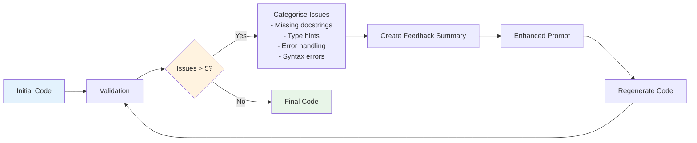
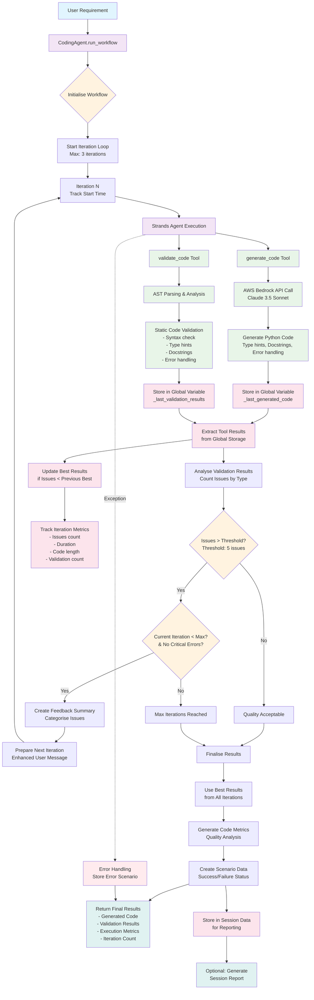

# AI Python Coding Agent - Strands SDK Implementation

This is an advanced Python coding agent built with the Strands SDK that generates high-quality Python code through an intelligent iterative improvement system. The agent orchestrates code generation and validation tools, automatically improving code quality through feedback loops until it meets production standards.

## 🌟 Key Features

- **Iterative Code Improvement**: Automatically refines code through up to 3 iterations when validation finds issues
- **Intelligent Feedback Loop**: Analyses validation results and provides targeted improvement suggestions
- **Quality Standards**: Enforces comprehensive type hints, docstrings, error handling, and PEP 8 compliance
- **AWS Bedrock Integration**: Leverages Claude 3.5 Sonnet for advanced code generation
- **Comprehensive Validation**: Static analysis including syntax checking, AST parsing, and quality metrics
- **Session Reporting**: Generates detailed reports with metrics, iteration tracking, and code samples
- **Best Result Preservation**: Tracks and returns the highest quality code across all iterations

## 🏗️ Architecture

The system consists of three main components:

### 1. **Supervisor Agent (CodingAgent)**
- Orchestrates the workflow and manages iterative improvement
- Tracks session data and generates comprehensive reports
- Implements intelligent retry logic with quality thresholds

### 2. **Code Generation Tool (`generate_code`)**
- Calls AWS Bedrock API with Claude 3.5 Sonnet model
- Generates production-ready Python code with comprehensive requirements
- Enforces type hints, docstrings, error handling, and PEP 8 compliance

### 3. **Code Validation Tool (`validate_code`)**
- Performs AST parsing and static analysis
- Validates syntax, type hints, docstrings, and error handling
- Returns detailed feedback for iterative improvement

## 📊 Quality Metrics & Iteration Logic

The agent uses an **improvement threshold of 5 issues**:
- **≤ 5 issues**: Code quality acceptable, iteration stops
- **> 5 issues**: Triggers automatic regeneration with targeted feedback
- **Maximum 3 iterations** to prevent infinite loops
- **Best result preservation** ensures highest quality output

### Quality Checks Include:
- ✅ Syntax validation and compilation
- ✅ Type hints for functions and parameters
- ✅ Comprehensive docstrings (Google/Sphinx style)
- ✅ Proper error handling with try/except blocks
- ✅ PEP 8 compliance
- ✅ Input validation where appropriate

## 🛠️ Prerequisites

### System Requirements
- **Python**: >= 3.12
- **AWS Account** with Bedrock access
- **Claude 3.5 Sonnet** model enabled in your AWS region

### Python Environment Setup

```bash
# Using pyenv (recommended)
pyenv versions
pyenv install 3.12.8
pyenv local 3.12.8
python --version # to confirm the version
eval "$(pyenv init -)" # if the version is not 3.12.8

# Create and activate virtual environment
python -m venv .venv
source .venv/bin/activate  # On Windows: .venv\Scripts\activate
```

### Dependencies Installation

From the project root directory:

```bash
# Install all dependencies using uv (recommended)
uv sync

# Or using pip
pip install anthropic>=0.52.2 \
           beautifulsoup4>=4.13.4 \
           boto3>=1.38.32 \
           burr[start]>=0.40.2 \
           instructor>=1.8.3 \
           python-dotenv>=1.1.0 \
           strands-agents>=0.0.1 \
           strands-agents-builder>=0.0.1 \
           strands-agents-tools>=0.0.1
```

## ⚙️ Configuration

### 1. AWS Configuration

Set up AWS SSO or configure credentials:

```bash
# AWS SSO (recommended)
aws configure sso
aws sso login

# Or configure directly
aws configure
```

### 2. Environment Variables

Create `.env` file by copying from `.env.example.` in the project root:

```env
AWS_REGION=<complete me>
AWS_PROFILE=<complete me>
BEDROCK_MODEL_ID=anthropic.claude-3-5-sonnet-20241022-v2:0
```

**Note**: Update the AWS_PROFILE and AWS_REGION according to your AWS setup.

### 3. Verify AWS Bedrock Access

Ensure you have access to Claude 3.5 Sonnet in your AWS region:

```bash
aws bedrock list-foundation-models --region ap-southeast-2 | grep claude-3-5-sonnet
```

## 🚀 Usage

### Basic Usage

```python
import asyncio
from ai_agent_strands import CodingAgent

async def main():
    agent = CodingAgent()
    
    # Generate code for a requirement
    result = await agent.run_workflow(
        "Create a function that calculates the factorial of a number using recursion"
    )
    
    if result["success"]:
        print("Generated Code:")
        print(result["generated_code"])
        print(f"\nExecution time: {result['execution_time']:.2f}s")
        print(f"Iterations used: {result['iterations_used']}")
        print(f"Final issues: {result['final_issues_count']}")
    else:
        print(f"Error: {result['error']}")

if __name__ == "__main__":
    asyncio.run(main())
```

### Generate Session Reports

After running scenarios, generate comprehensive reports:

```python
# The agent automatically generates session reports
report_path = agent.save_session_report()
print(f"Report saved to: {report_path}")
```

## 📈 Understanding the Output

### Workflow Results

Each `run_workflow()` call returns:

```python
{
    "success": bool,                    # Overall success status
    "generated_code": str,              # Final Python code
    "validation_results": List[str],    # Validation feedback
    "execution_time": float,            # Total execution time (seconds)
    "explanation": str,                 # AI explanation of the code
    "code_metrics": Dict[str, Any],     # Code quality metrics
    "iterations_used": int,             # Number of iterations performed
    "final_issues_count": int           # Final validation issues count
}
```

### Session Reports

Comprehensive reports include:

- **📊 Executive Summary**: Success rates, execution times, quality metrics
- **🔄 Iterative Improvement Analysis**: Iteration tracking and improvement rates
- **📝 Scenario Details**: Per-scenario breakdown with metrics
- **🎯 Generated Code Samples**: Complete code with metrics
- **💡 Recommendations**: Performance and quality improvement suggestions

## 🔄 Iterative Improvement Process

The agent follows this intelligent improvement workflow:



## 🏗️ Complete Workflow Architecture

The following diagram shows the complete workflow architecture from `ai_agent_strands.py`, illustrating how the supervisor agent orchestrates the two tools in an iterative improvement system:



### Per-Iteration Tracking

Each iteration captures:
- **Issues Count**: Number of validation problems
- **Duration**: Time taken for the iteration
- **Code Length**: Character count of generated code
- **Validation Count**: Number of validation checks performed

## 📁 Project Structure

```
02_ai_agent/
├── ai_agent_strands.py              # Main agent implementation
├── ai_workflow_diagram.md           # Architecture diagrams
├── README.md                        # This documentation
├── 02_ai_agent_test.py             # Basic Strands SDK test
├── strands_agent_session_report_*.md # Generated session reports
└── __pycache__/                     # Python cache files
```

## 🎯 Example Scenarios

### 1. Simple Function Generation

```python
agent = CodingAgent()
result = await agent.run_workflow(
    "Create a function that validates email addresses using regex"
)
```

### 2. Complex Data Processing

```python
result = await agent.run_workflow("""
Create a function that processes a large dataset with multiple data validation steps,
statistical analysis, error handling, and generates visualisations. The function should
handle missing data, outliers, and provide comprehensive reporting.
""")
```

### 3. Web Scraping with Error Handling

```python
result = await agent.run_workflow("""
Implement a sophisticated web scraper with rate limiting, authentication handling,
session management, robots.txt compliance, and comprehensive error handling.
Include detailed logging, type hints, and unit tests.
""")
```

## 📊 Performance Metrics

Typical performance benchmarks:

- **Success Rate**: 95-100% for well-defined requirements
- **Average Execution Time**: 150-400 seconds per scenario
- **Iteration Efficiency**: 70% of scenarios complete in 1-2 iterations
- **Code Quality**: 100% compliance with type hints, docstrings, and error handling
