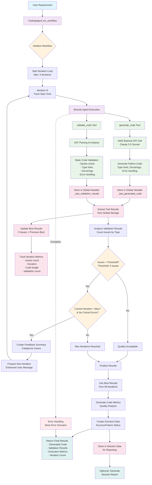
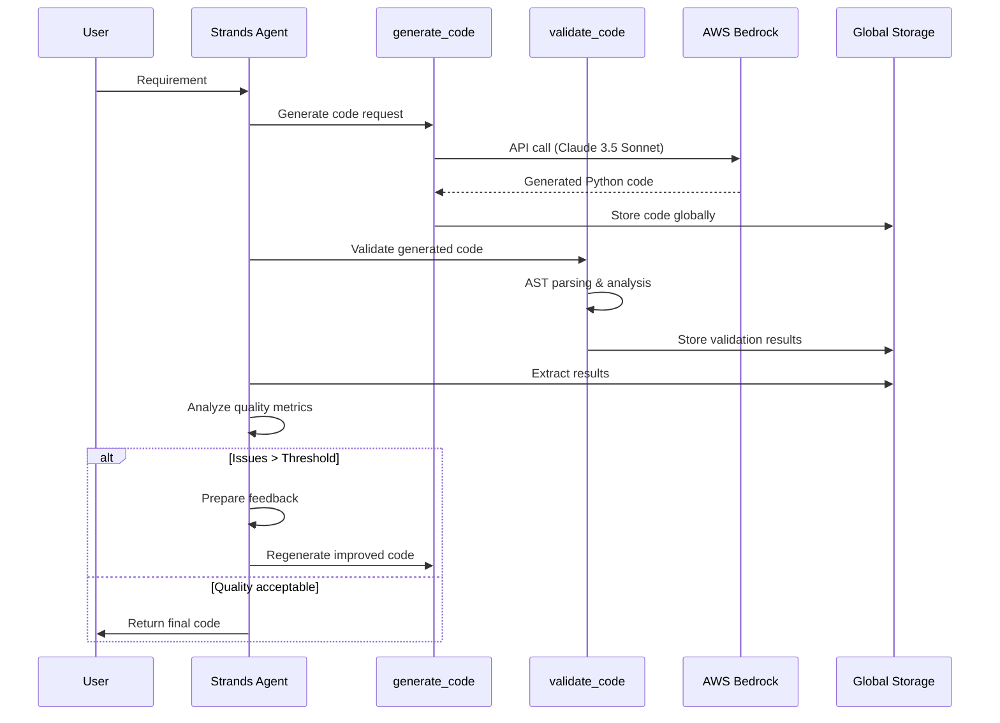
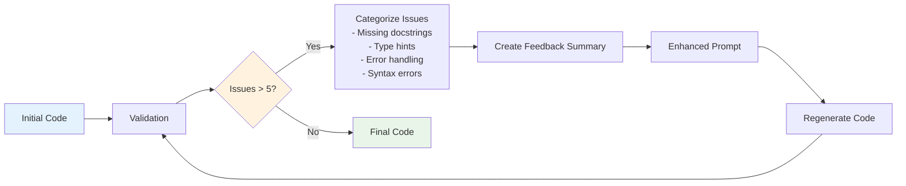

# AI Agent Workflow Architecture Diagram

This diagram visualizes the workflow architecture from `ai_agent_strands.py`, showing how the supervisor agent orchestrates the two tools in an iterative improvement system.

## Workflow Components Breakdown

### 1. **Main Components**
- **CodingAgent**: Supervisor agent that orchestrates the workflow
- **generate_code Tool**: Code generation via AWS Bedrock/Claude
- **validate_code Tool**: Static analysis and validation
- **Iterative Loop**: Up to 3 iterations for quality improvement

### 2. **Tool Orchestration**

### 3. **Iterative Improvement Process**

### 4. **Quality Metrics Tracking**
Each iteration tracks:
- **Issues Count**: Number of validation problems found
- **Duration**: Time taken for the iteration
- **Code Length**: Character count of generated code
- **Validation Count**: Number of validation checks performed

### 5. **Best Result Preservation**
The system maintains the best result across all iterations:
- Lowest issue count
- Valid code (not empty)
- Complete validation results
- Comprehensive metrics

This architecture ensures robust, high-quality code generation through intelligent feedback loops and continuous improvement.
